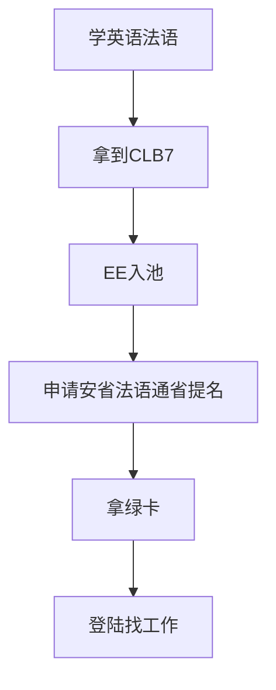

## 综述

根据[加拿大统计局](https://www.statcan.gc.ca/en/start)首页给出的数据，加拿大人口大概4000万左右，2023年第3季度gpd增长是-0.3%，而第2季度gdp正向增长了0.3%，根据[这张图](https://www150.statcan.gc.ca/n1/daily-quotidien/231130/cg-a001-eng.htm)可以看到如果2023年第4季度不负增长的话，那么2023的gdp大概应该是在1%左右，有增长，但不显著。所以宏观上讲，加拿大的经济目前也是增长乏力，可见找工作应该是比较有难度的。

加拿大是一个传统的移民国家，根据[这里](https://www.statcan.gc.ca/en/subjects-start/immigration_and_ethnocultural_diversity)的数据，2021年移民大概占总人口数的23%，好像之前看到新闻(todo 求证)说加拿大2025年将引入50万左右的新移民，大概占总人口的0.625%左右，试想一下，如果是中国同等比例将会是875万人，相当一半的深圳市常驻人口，比例和数据都是非常惊人的。毕竟加拿大气候相对恶劣，又有美国在旁边吸血，不持续吸纳移民的话整个国家的经济发展将会更加的无以为继，持续接收移民将会是加拿大的长期国策，短期可能有波动，不过拉长时间来看，枫叶国的移民之路应该是相对确定和稳定的。

因为是老牌移民国家，加拿大的移民政策博大精深，加上政策的反复横跳，所以普通人很难一己之力选择最合适自己的方案，毕竟套餐太多，容易挑花眼。这也给了中介机构广阔的生存空间，存在即合理，这点不需要深究。

关于加拿大移民的文章和视频也是汗牛充栋，这里就不一一列举了，有兴趣的同学可以自行搜索，全面的了解一下加拿大的移民体系和逻辑是非常必要的。[这里](https://inforun.info/)有非常全面的关于枫叶国信息的汇总和整理，可以先粗略浏览一遍，有个大致印象先。

## 核心逻辑

在之前的总论里有讲到过，大部分移民国家的逻辑都是雇主担保，能找到工作或者雇主配合才是王道。加拿大也不能免俗，但枫叶国僧多粥少，有同样想法的聪明人估计数量也不少，所以走这条路可能困难重重。

不过加拿大还有一个逻辑，就是掐尖，只要你足够优秀，还是可以在海外直接申请绿卡的。这里我研究的结论是学法语通过法语移民可能是一个比较理性的选择。

### 法语项目流程

这里的行业术语比较多。

**CLB7**: Canadian Language Benchmarks（CLB）是加拿大的一种英语和法语的语言等级评估标准，CLB分为12个等级。CLB7是法语学习者在法语能力评估中所能达到的最高等级之一，也是加拿大联邦法语语言资格认证的最高标准之一，它代表着高水平的法语能力，可以用于高端工作、进入高等院校和移民等领域。CLB7的法语语言能力表现为：可以听懂流利的长句，能够辨别语调和俚语；可以流利地口语并表达自己的想法；能够阅读大约两页的高级资料，包括专业课程材料；能够写大小约150单词的论文，语言达到高级水平。

## References 

* [CA 统计局](https://www.statcan.gc.ca/)