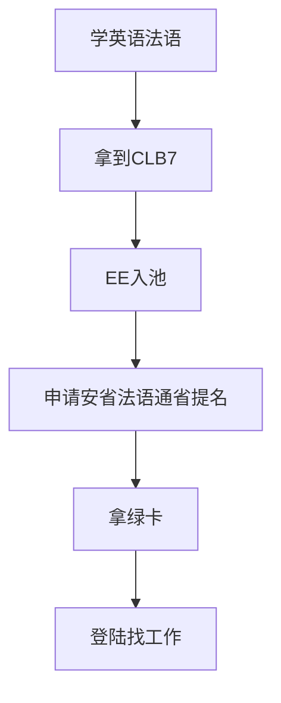

## 综述

根据[加拿大统计局](https://www.statcan.gc.ca/en/start)首页给出的数据，加拿大人口大概4000万左右，2023年第3季度gpd增长是-0.3%，而第2季度gdp正向增长了0.3%，根据[这张图](https://www150.statcan.gc.ca/n1/daily-quotidien/231130/cg-a001-eng.htm)可以看到如果2023年第4季度不负增长的话，那么2023的gdp大概应该是在1%左右，有增长，但不显著。所以宏观上讲，加拿大的经济目前也是增长乏力，可见找工作应该是比较有难度的。

加拿大是一个传统的移民国家，根据[这里](https://www.statcan.gc.ca/en/subjects-start/immigration_and_ethnocultural_diversity)的数据，2021年移民大概占总人口数的23%，好像之前看到新闻(todo 求证)说加拿大2025年将引入50万左右的新移民，大概占总人口的0.625%左右，试想一下，如果是中国同等比例将会是875万人，相当一半的深圳市常驻人口，比例和数据都是非常惊人的。毕竟加拿大气候相对恶劣，又有美国在旁边吸血，不持续吸纳移民的话整个国家的经济发展将会更加的无以为继，持续接收移民将会是加拿大的长期国策，短期可能有波动，不过拉长时间来看，枫叶国的移民之路应该是相对确定和稳定的。

因为是老牌移民国家，加拿大的移民政策博大精深，加上政策的反复横跳，所以普通人很难一己之力选择最合适自己的方案，毕竟套餐太多，容易挑花眼。这也给了中介机构广阔的生存空间，存在即合理，这点不需要深究。

关于加拿大移民的文章和视频也是汗牛充栋，这里就不一一列举了，有兴趣的同学可以自行搜索，全面的了解一下加拿大的移民体系和逻辑是非常必要的。[这里](https://inforun.info/)有非常全面的关于枫叶国信息的汇总和整理，可以先粗略浏览一遍，有个大致印象先。

## 核心逻辑

在之前的总论里有讲到过，大部分移民国家的逻辑都是雇主担保，能找到工作或者雇主配合才是王道。加拿大也不能免俗，但枫叶国僧多粥少，有同样想法的聪明人估计数量也不少，所以走这条路可能困难重重。

不过加拿大还有一个逻辑，就是掐尖，只要你足够优秀，还是可以在海外直接申请绿卡的。这里我研究的结论是**学法语通过法语移民可能是一个比较理性的选择**。

### 安省法语项目流程

这里的行业术语比较多。

**CLB7**: Canadian Language Benchmarks（CLB）是加拿大的一种英语和法语的语言等级评估标准，CLB分为12个等级。CLB7是法语学习者在法语能力评估中所能达到的最高等级之一，也是加拿大联邦法语语言资格认证的最高标准之一，它代表着高水平的法语能力，可以用于高端工作、进入高等院校和移民等领域。CLB7的法语语言能力表现为：可以听懂流利的长句，能够辨别语调和俚语；可以流利地口语并表达自己的想法；能够阅读大约两页的高级资料，包括专业课程材料；能够写大小约150单词的论文，语言达到高级水平。

**EE入池**: 参考[这里](https://inforun.info/express-entry)
**安省**: 加拿大的[安大略省](https://www.ontario.ca/page/government-ontario), 是🍁国最重要的人口大省和经济大省，多伦多和渥太华都在安省。参考[这里](https://inforun.info/%E5%AE%89%E5%A4%A7%E7%95%A5)
**省提名**: 参考[这里](https://inforun.info/%E7%9C%81%E6%8F%90%E5%90%8D)

下面要重点讲一下安省的法语通道。

### Ontario’s Express Entry French-Speaking Skilled Worker stream

根据[官方网站](https://www.ontario.ca/page/ontarios-express-entry-french-speaking-skilled-worker-stream)的信息，总结一下几点有用的信息。

- 申请人必须EE入池，至少需要67分，我自己评估了一下，对于年龄大拖家带口的人事来说，配偶雅思4个6能加5分，这个非常关键；
- 工作经验：申请人必须决定自己想要被评估的两个联邦计划之一：联邦技术工人计划或加拿大经验类别。申请人的工作经验必须在过去五年内在TEER类别0、1、2或3的国家职业分类（NOC）中连续工作至少一年，且必须与其在快速通道系统中的主要职业相同。对于程序员来说，需要一年的连续工作经验，这点应该不难；
- 教育：bing总结说申请人必须拥有与其在快速通道系统中的主要职业相对应的教育证书。不过我看原文是没有的，应该只是只要加拿大认可的本科以上学历就好了；
- 语言：申请人必须证明自己在法语和英语的所有四个组成部分（口语、阅读、写作和听力）中具有足够的语言能力。这些水平是法语的加拿大语言基准（CLB）7级和英语的CLB 6级。就是法语要clb7英文要clb6；这两点合在一起其实非常难，不过越难的话申请的人数可能越少，反而是优势；
- 要有钱在安省安家。根据[官方文档](https://www.canada.ca/en/immigration-refugees-citizenship/services/immigrate-canada/express-entry/documents/proof-funds.html)中的内容，三口之家大概需要21000刀的存款，大概11万人民币；
- 要有安省的居住意向，访问过安省或者安省有面试都算，应该不难；

具体的申请流程在[这里](https://www.ontario.ca/page/ontarios-express-entry-system-streams)。

### 数据分析

根据[安省官网2023年的存档数据](https://www.ontario.ca/page/2023-ontario-immigrant-nominee-program-updates),我们可以综合分析出以下信息

- 2023年大概捞取了5次，其中有2次是根据职位的定向邀请，分别是June 5, 2023(it类最低分数是348)以及March 16, 2023(it类最低分数是291)，其他3次的最低分大概是在350分以下，所以综合判断，it类的职位在这个通道应该是350就能上岸；
- 2022年法语通道提名人数是583人，占总提名数的6%左右，非常小众，大多数人应该看不上；
- 2022年的省提名中，从事it行业相关的人数是NOC 2173 - Software engineers and designers 729 + NOC 2174 - Computer programmers and interactive media developers 341 + NOC 2172 - Database analysts and data administrators	301 + NOC 2175 - Web designers and developers	167 + NOC 2171 - Information systems analysts and consultants	139 = 1677，占总人数的17%; 稍微看了一眼，从单一品类来看，应该是省提名的最主要职位类别了；
- 从2022年的省提名人口分布上看，中国加印度一共5524+1155 = 6679人，占总提名数的68.5%，其中印度就占了56.6%，是最重要的竞争对手，从语言上来说，印度人学法语的可能不多，所以不是直接竞争对手。排名第三的是尼日利亚(	446)，占总数的4%，他们应该是说法语，另外尼日利亚的it外包最近也有隐隐追赶印度的趋势，所以口语猜测他们应该是法语通道最直接的受益人群，也是核心竞争对手；
- 法语通道申请人数和邀请人数目前没有查到，大概3月份应该有2023年的数据统计，到时候再对比看一下趋势；

### 联邦法语优先项目

加拿大联邦也有法语优先项目，[官网看上去也在宣传各种好处](https://www.canada.ca/en/immigration-refugees-citizenship/campaigns/francophone-immigration-outside-quebec/francophone-immigration-express-entry.html)，这个项目的好处也是显而易见的。
- 速度快，毕竟是联邦ee，应该是最快速的通道
- 法语能力最多能在[CRS](https://ircc.canada.ca/english/immigrate/skilled/crs-tool.asp)里加50分，哪怕法语不是第一语言
- 根据[官方捞人记录](https://www.canada.ca/en/immigration-refugees-citizenship/corporate/mandate/policies-operational-instructions-agreements/ministerial-instructions/express-entry-rounds.html)，以及[官方申请人数](https://www.canada.ca/en/immigration-refugees-citizenship/services/immigrate-canada/express-entry/submit-profile/rounds-invitations.html)分析, 2023年法语优先通道总共邀请了8700人，CRS分数的中位数是454分，2024年1月份又捞了1次，一共7000人，中位数是365分，300多分的中位数估计跟安省的中位数都差不多了，证明2024年这一波基本上高分的都捞完了。

### 安省法语项目和联邦法语项目对比

- 首先速度上，联邦的要比安省快
- 加分项上两边应该是一样的，所以没有优劣
- 目前看来安省的分数可能会低一点
- 联邦的捞人数量会更多一点，当然竞争也更充分一些，毕竟分稍高
- 安省有职位定向捞取，从上面的分析上可以看出，对程序员可能更有优势一点

### 结论

- 法语项目不需要雇主担保，似乎不需要中介也能申请，只要考试拿分就行了，减少了被雇主和中介拿捏的风险；另外不用去加拿大也能海外申请，降低了前期投入的成本；
- 法语要到clb7才能体现出优势
- **能走联邦的法语项目就走联邦**，毕竟速度快，数量多，而且2023年稳定捞取了6次，政策上看来是比较稳定的
- 分不够或者是程序员可以考虑安省，可以叠大龄+程序员的buff，毕竟安省有定向捞取
- 目前不清楚是不是第一语言选法语的才能走联邦的法语通道，需要求证todo

### 真实案例
- [小红书上有人分享法语优先通道被抽中的经历](https://www.xiaohongshu.com/explore/65bf825c000000000c0076b0)

## References 

* [CA 统计局](https://www.statcan.gc.ca/)
* [EE每个分数段的申请人数](https://www.canada.ca/en/immigration-refugees-citizenship/services/immigrate-canada/express-entry/submit-profile/rounds-invitations.html)
* [EE每次捞人记录](https://www.canada.ca/en/immigration-refugees-citizenship/corporate/mandate/policies-operational-instructions-agreements/ministerial-instructions/express-entry-rounds.html)
