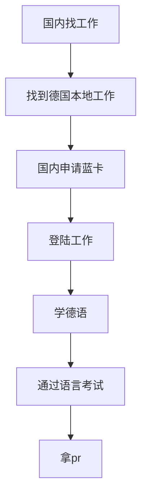

### 德国的基本情况

[这个网站](https://www.destatis.de/EN/Home/_node.html) 提供了多维度的关于德国的数据统计信息，可以拿来参考。

* 从[这里](https://www.destatis.de/EN/Themes/Economy/National-Accounts-Domestic-Product/Tables/gdp-bubbles.html) 可以看到2023年德国的gdp基本没有增长，甚至有轻微下降出去，这就意味着在德国找工作可能并不是一件非常轻松的事情。
* 德国人口[8400万](https://www.destatis.de/EN/Themes/Society-Environment/Population/Current-Population/_node.html), 有移民背景的人口数是[2380万](https://www.destatis.de/EN/Themes/Society-Environment/Population/Migration-Integration/_node.html)，大概28%的人口是移民或者是移民后裔，应该有一定的文化多样性。
* 德国的最低工资是[12.41欧](https://www.destatis.de/EN/Themes/Labour/Earnings/Minimum-Wages/_node.html)，麦当劳套餐的价格是10欧，平均工资大概是3000欧的水平，德国柏林生活水平跟上海相比的结果在[这里](https://www.numbeo.com/cost-of-living/compare_cities.jsp?country1=China&country2=Germany&city1=Shanghai&city2=Berlin)，物价大概贵55%，吃饭贵102%，不过本地购买力柏林比上海要高65%，考虑到准备到德国去的同学的收入水平肯定是大大高于上海的平均收入水平的，所以可以简单的认为去了德国在工资不变的情况下，家庭的花销要高不少。

### 德国路径

### 签证类型

对于IT人员来说主要可以考虑的签证就是德国蓝卡。

德国蓝卡（[EU Blue Card](https://www.make-it-in-germany.com/en/visa-residence/types/eu-blue-card)）是一种颁发给非欧盟/欧洲经济区高技能移民的居留许可，允许持卡人及其家属在德国工作和生活。 它类似于美国的绿卡，但有效期通常为一到四年，可续签，并在失去工作后仍允许在欧盟内部停留半年。

以下是德国蓝卡的一些关键信息：

**申请资格:**

* 拥有认可的高等教育学位 (学士学位或以上)，该学位必须与您在德国的工作相匹配。
* 拥有德国雇主提供的有效工作合同，年薪达到最低要求 (2023 年为 58,400 欧元，某些特定行业为 45,304 欧元)。
* 拥有足够生活费的健康保险证明。
* 语言要求没有强制规定，但德语能力会增加获得和续签蓝卡的可能性。

**优势:**

* 免除大多数工作签证的繁琐申请流程。
* 允许家属团聚 (配偶和子女)。
* 在德国居住四年并满足条件后，可以申请永久居留权。
* 在欧盟其他国家停留长达一年，无需额外签证。

**申请流程:**

* 联系德国雇主并获得工作合同。
* 收集所需文件，如学位证书、工作合同、健康保险证明等。
* 向您所在国家的德国使领馆提交申请。
* 缴纳申请费。
* 等待审理结果。

**更多信息:**

* 德国联邦内政部： [https://www.make-it-in-germany.com/en/visa-residence/types/eu-blue-card](https://www.make-it-in-germany.com/en/visa-residence/types/eu-blue-card)
* 德国外交部： [https://taipei.diplo.de/tw-en/service/visa/-/2455584](https://taipei.diplo.de/tw-en/service/visa/-/2455584)
* 欧盟委员会： [https://immigration-portal.ec.europa.eu/eu-blue-card/essential-information_en](https://immigration-portal.ec.europa.eu/eu-blue-card/essential-information_en)
* [移民基本信息](https://www.bmi.bund.de/EN/topics/migration/immigration/labour-migration/generell-information/general-information-node.html)

### 蓝卡DIY攻略

- [攻略1](https://www.xiaohongshu.com/explore/649080e4000000001300d8d2)
- [良心经验❗️德国蓝卡递签，材料注意事项](https://www.xiaohongshu.com/explore/659960ca000000001d036720)
- [攻略3](https://www.xiaohongshu.com/explore/62c746b1000000002103d0aa)
- [EU Blue Card Germany](https://www.germany-visa.org/immigration/residence-permit/eu-blue-card-germany/)

### 德国求职网站

* **Monster:** 德国最大的招聘网站之一，职位发布量丰富，涵盖各类行业和职能。[[https://www.monster.de](https://www.monster.de)]
* **Indeed:** 知名国际招聘平台，界面简洁易用，职位数量庞大。[[https://de.indeed.com](https://de.indeed.com)]
* **Xing:** 德国本土职业社交平台，除了发布和寻找职位，也可建立人脉网络。[[https://www.xing.com](https://www.xing.com)]

### 德语学习

获得德国永久需要学习德语，具体要求在[这里](https://www.bamf.de/EN/Themen/MigrationAufenthalt/ZuwandererDrittstaaten/Migrathek/BlaueKarteEU/blauekarteeu-node.html)。

原文是:

> Faster acquisition of a settlement permit: Holders of an EU Blue Card will receive a settlement permit after 33 months in Germany if they have been in highly-qualified employment and paid contributions into a pension fund during this period, and are able to make themselves understood in German on a basic level. The qualification period is shortened to 21 months for persons with an adequate knowledge of German (level B1).

所以要想最快21个月拿pr，那么德语要到B1的水平，根据[人云亦云的结果](https://zhuanlan.zhihu.com/p/64921086)，德语B1应该不容易，当然，也有[狠人两个月拿到B1的](https://zhuanlan.zhihu.com/p/38489096)，所以结论大概就是很难，但只要下苦功夫也许也没有想象中的那么难。

### 成功案例

TODO