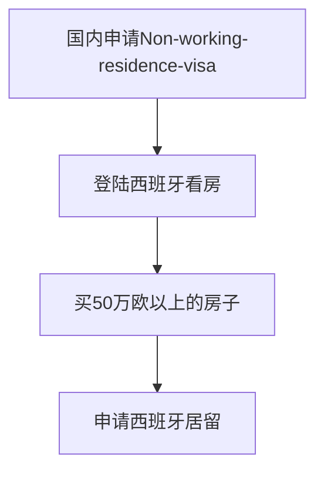
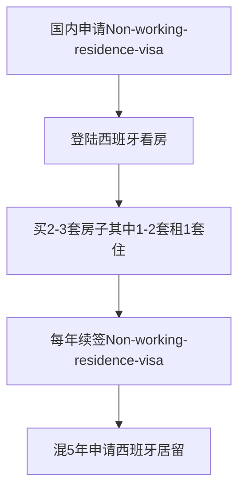

### 西班牙的基本情况

TODO

### 西班牙路径

西班牙的核心逻辑是在西班牙居住5年，然后申请永居卡。但是这个永居卡的期限也只有5年，所以5年之后还要再续。因为**移民监**的问题，续卡的时候你可能还是需要满足每年在西班牙待满183天的要求(需要求证)，所以可能一日西班牙，终生西班牙。

**路径1:50万欧买房一步到位**

该路径的法理依据是[西班牙投资移民](https://www.exteriores.gob.es/Consulados/londres/en/ServiciosConsulares/Paginas/Consular/Visado-de-inversor.aspx)中的第2条，购买50万欧的房产就可以申请投资移民visa，可能也是中介口中的黄金签证(需要求证)。

为了增加可控性和容错率，这里首先申请了[Non-working residence visa](https://www.exteriores.gob.es/Consulados/londres/en/ServiciosConsulares/Paginas/Consular/Visado-de-residencia-no-lucrativa.aspx)，这可能是中介说的非盈利签证(需要求证)。该visa可以在国内diy申请，要满足的条件好像只是要求
> The minimum required amount is equivalent to 400% of Spain's Public Multiple Effects Income Indicator (IPREM). 

所需的最低金额相当于西班牙公共多效应收入指标 (IPREM) 的 400%。查了一下大概是3万欧(需要求证)左右，也就是单人30万人民币左右，3口之家大概30万以上也可以。根据[小红书用户成都板鸭哥的推算](https://www.xiaohongshu.com/explore/65be207b000000000702bf5a)，签证成本大概是1个人1万人民币左右，小孩减半，3口之家大概2.5万人民币。

Non-working residence visa的好处就是你可以在西班牙生活12个月，可以看12个月的房子，选真正优质的资产去购买，这比从国内找中介要可控和靠谱。退一步说如果登陆之后对西班牙不满意的话还能回国，进可攻退可守，容错率大大提升。

需要注意的是还是根据小红书用户成都板鸭哥提供的信息，一家三口西班牙居住一年的成本是40万人民币左右，花费还是挺高的，就算是你一登陆就买到了房子申请了pr，但pr审核是需要时间的，在这段审核期间无法工作，多带点钱才是王道，不过买了房就不需要房租了，压力可能会小一点点吧。

**路径2:买房收租混5年**

改路径的核心逻辑是西班牙的房产租售比相对来说还是可以的，根据[这里](https://www.numbeo.com/property-investment/compare_cities.jsp?country1=China&country2=Spain&city1=Guangzhou&city2=Valencia)的估算，假设在瓦伦西亚的市中心买个60平的房子，成本大概是`17283.22 * 60=1036993`，而每年的租金大概是`7478.46 * 12=89741`，除去各种成本，大概有7%左右的年化收益率。如果买2套的话一个月租金大概就是1800欧左右，基本可以覆盖一家人的生活成本。另外再买一套房子自住，这样不用工作的话也应该可以撑5年。

该路线不确定性非常大，不过好在有被动收入，因此大概可以缓解一些焦虑。另外Non-working residence visa一年后就可以转工签，如果运气好能找到工作的话，那么生活压力就会小很多了。

### 参考信息

- [西班牙visa官网](https://www.exteriores.gob.es/Consulados/londres/en/ServiciosConsulares/Paginas/inicio.aspx)
- [小红书成都板鸭哥](https://www.xiaohongshu.com/user/profile/64d485240000000001026b69)

### 成功案例

TODO