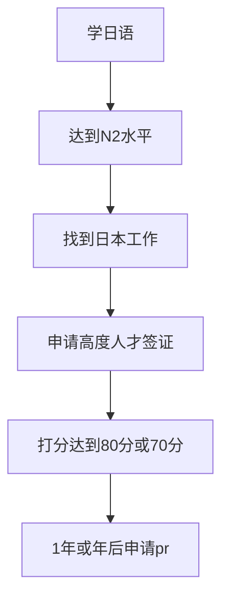

## 综述

日本是发达的西方资本主义国家，十多年前曾经去过一次，当时觉得这个国家还是非常现代化的。日本的东京和大阪都是世界著名的大都市，对于习惯于在北上广深生活的同学来说迁移的不适感可能也会小一点。另外我们80后这一代从小受日本的动漫影响非常大，在文化上其实是有一定的亲切感的，最后个人而言，我比较喜欢日本的推理小说，从江户川乱步到岛田庄司和东野圭吾，这点又是一个加分项了。不过日本最大的优势是和国内没有时差，海上生明月，可以天涯共此时，时区的共情往往非常重要。

## 核心逻辑
日本的核心逻辑也是雇主担保，所以要先找到工作，然后申请[高度人才签证](https://www.moj.go.jp/isa/publications/materials/newimmiact_3_system_index.html)。

## 流程

## 高度人才签证

[知乎这篇文章](https://zhuanlan.zhihu.com/p/516219736)应该是非常具体和完整了，另外[这篇](https://inforun.info/%E6%97%A5%E6%9C%AC)也对该签证做了介绍。

## 日语水平

没学过日语，不过日语里应该有不少的中文舶来词，加上都是东亚文化圈，所以学起来可能比其他语言相对要容易一点点。

关于日语的等级，具体可以看[这里](https://www.sohu.com/a/508506723_479892)，日语水平到N2的话应该是勉强可以在日企工作的。

## 总结

- 日本的逻辑跟其他地区没啥不一样，都是走的学语言然后当地找工作的路子
- 程序员可以试着在国内找人内推，也许语言不太行的时候就能找到工作

## 成功案例

朋友龙哥按照上面的流程申请了高度人才签证，目前等绿卡中。

