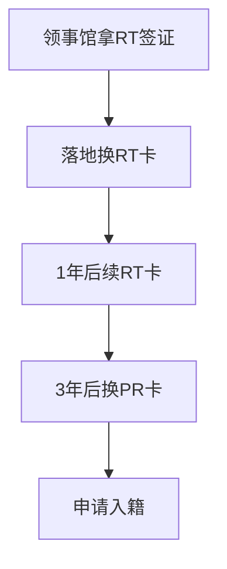

### 为什么选择墨西哥

说实话这是我看到墨西哥这个选项时感到迷惑的一点。因为人往高处走，水往低处流，墨西哥应该是发展中国家，整体的收入以及生活水平可能跟国内还是有差距的。

不过根据[【雪球独家】如何在北美洲过自己想过的生活 - 墨西哥绿卡入籍DIY一条龙指南（2024版本）](https://zhuanlan.zhihu.com/p/672118733)这篇文章里提供的观点，选择墨西哥的原因可能是

> 北美，欧洲，拉美游客首选国家。是中资基建，电信，移动互联网领域正在大规模投资的国家。是全世界Digital nomad远程办公的首选国家。

> 墨西哥是一个汇聚美国，欧洲，拉美，亚洲各国移民和文化的地方。

> 如果你在希望建立你的海外base，墨西哥是一个非常简单的选择。

观点仅供参考，不过如果你是Digital nomad的话墨西哥应该是有其独特的吸引力的。另外本着有卡就拿留条后路的原则，墨西哥绿卡也是值得考虑的。

### 墨西哥的基本情况

[这里](https://www.inegi.org.mx/)可以查到墨西哥的基本数据。

- 人口1.2亿
- gdp年增长2.4%
- 失业率2.8%

### 绿卡申请流程

根据[【雪球独家】如何在北美洲过自己想过的生活 - 墨西哥绿卡入籍DIY一条龙指南（2024版本）](https://zhuanlan.zhihu.com/p/672118733)稍微整理了一下，对于国内的同学来说，大致流程应该是

总的时间大概是4年，第1年需要飞2次墨西哥，可以当旅游，机票丰俭由人，5000-15000都有。3年后再飞1次墨西哥换pr，总的要飞3次，然后拿到墨西哥永居，墨西哥绿卡无移民监，无语言要求，这点很好。

当然如果可以直接申请PR卡的话，流程大概是`领事馆拿RP签证 -> 落地换RP卡 -> 申请入籍`。

### 成功案例

TODO

